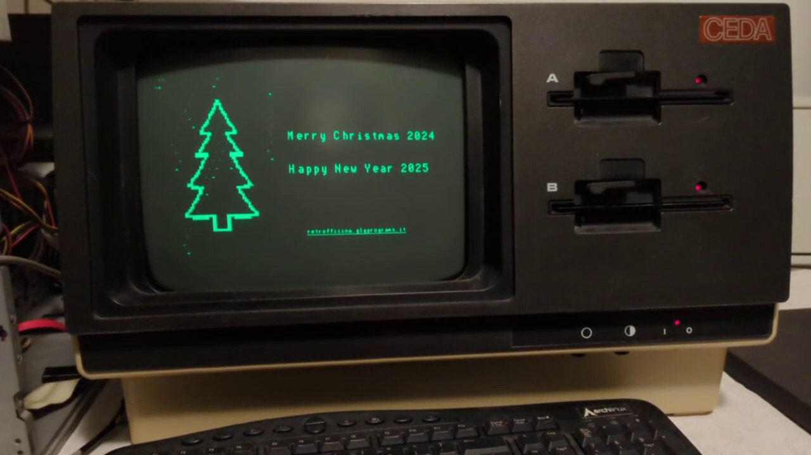

# ceda-img

The goal of this project is to give the Sanco computer some graphics capabilities.

- `genrom.c`: generate extended character ROM
- `cedaimg.c`: convert an image into the ceda-img format

## Build
```
make
```

## Convert PNG or PGM to IMC
Image must be 160x100, 1 bpp

```
magick hello.png -depth 1 hello.gray && ./cedaimg < hello.gray > hello.imc
```


